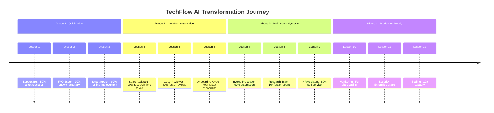

# AI Agents Playground

Learn to build AI-powered applications that drive **real business efficiency** using the **Microsoft Agent Framework (MAF)** with Python and **GitHub Copilot Models**.

## 🏢 The Business Scenario

**Meet TechFlow Solutions**, a mid-sized software consulting company with 150 employees. Like many growing companies, TechFlow faces common operational challenges:

- **Customer Support Team** is overwhelmed with repetitive questions and ticket routing
- **Sales Team** spends hours manually researching prospects and preparing proposals
- **Engineering Team** struggles with code reviews, documentation, and onboarding new developers
- **HR Department** manually handles employee questions about policies, benefits, and procedures
- **Operations Team** deals with invoice processing, vendor management, and reporting

**Your Mission**: Help TechFlow transform their operations by building AI agents that eliminate bottlenecks, reduce manual work, and free employees to focus on high-value tasks.

---

## 🎯 Learning Journey

Each lesson solves a real business problem at TechFlow, demonstrating measurable efficiency improvements. You'll receive **pre-built, production-ready solutions** that you can study, run, and adapt.

### Your Learning Path



### **Phase 1: Quick Wins - Automating Simple Tasks**

#### Lesson 1: The Support Bot - First Line of Defense
**Business Problem**: Support team receives 200+ daily tickets, 60% are repetitive questions.  
**Solution**: Build an AI support agent that answers common questions instantly.  
**Impact**: Reduce ticket volume by 50%, save 15 hours/week of support time.

**What You'll Learn**:
- Setting up Microsoft Agent Framework with GitHub Copilot Models
- Creating your first ChatAgent with domain-specific instructions
- Testing and deploying a simple conversational agent

**Pre-Built Solution**: Complete working support bot with 50+ common Q&A patterns

---

#### Lesson 2: The FAQ Expert - Knowledge at Scale
**Business Problem**: Support bot needs to answer from a 500-page knowledge base.  
**Solution**: Add Retrieval-Augmented Generation (RAG) to search documentation.  
**Impact**: Answer accuracy increases to 90%, handle 300+ unique questions.

**What You'll Learn**:
- Document indexing and embeddings
- Semantic search with vector databases
- Integrating RAG into your agent workflow

**Pre-Built Solution**: RAG-enabled support agent with document pipeline

---

#### Lesson 3: The Smart Router - Right Person, Right Time
**Business Problem**: 40% of tickets are routed to wrong team, causing delays.  
**Solution**: Build an agent that analyzes tickets and routes them intelligently.  
**Impact**: Reduce misrouted tickets by 80%, save 10 hours/week in rework.

**What You'll Learn**:
- Function calling and tool integration
- Classification and decision-making logic
- Integrating with ticketing systems (Jira, ServiceNow)

**Pre-Built Solution**: Ticket routing agent with classification tools

---

### **Phase 2: Workflow Automation - Connecting Systems**

#### Lesson 4: The Sales Assistant - From Lead to Proposal
**Business Problem**: Sales team spends 6 hours per prospect researching and preparing proposals.  
**Solution**: Build an agent that researches companies and generates proposal drafts.  
**Impact**: Reduce research time by 70%, generate proposals in 30 minutes.

**What You'll Learn**:
- Multi-step workflows and task orchestration
- Web scraping and API integration tools
- Document generation with structured outputs

**Pre-Built Solution**: Sales research agent with proposal generator

---

#### Lesson 5: The Code Reviewer - Quality at Speed
**Business Problem**: Code reviews take 2-3 days, blocking development velocity.  
**Solution**: Build an agent that performs initial code review and suggests improvements.  
**Impact**: Reduce review time by 50%, catch common issues automatically.

**What You'll Learn**:
- Analyzing code with AI agents
- Integration with GitHub/Azure DevOps
- Providing structured feedback and suggestions

**Pre-Built Solution**: Code review agent with best practices engine

---

#### Lesson 6: The Onboarding Coach - Accelerating New Hires
**Business Problem**: New developers take 3 months to become productive.  
**Solution**: Build an agent that answers questions and guides through codebase.  
**Impact**: Reduce onboarding time by 40%, improve new hire confidence.

**What You'll Learn**:
- Interactive learning agents with memory
- Codebase navigation and explanation
- Personalized learning paths

**Pre-Built Solution**: Onboarding assistant with codebase intelligence

---

### **Phase 3: Multi-Agent Systems - Complex Problem Solving**

#### Lesson 7: The Invoice Processor - End-to-End Automation
**Business Problem**: Processing 500 monthly invoices takes 80 hours of manual work.  
**Solution**: Build a multi-agent system that extracts, validates, and processes invoices.  
**Impact**: Reduce processing time by 90%, eliminate 95% of manual data entry.

**What You'll Learn**:
- Multi-agent architecture and coordination
- Document processing and OCR integration
- Validation workflows and error handling

**Pre-Built Solution**: Complete invoice automation system with 3 specialized agents

---

#### Lesson 8: The Research Team - Competitive Intelligence
**Business Problem**: Creating market research reports takes 20+ hours per report.  
**Solution**: Build an agent team that researches, analyzes, and writes reports.  
**Impact**: Generate comprehensive reports in 2 hours, 90% time savings.

**What You'll Learn**:
- Agent delegation and handoffs
- Research, analysis, and writing agents working together
- Quality control and fact-checking

**Pre-Built Solution**: Multi-agent research system (Researcher + Analyst + Writer)

---

#### Lesson 9: The HR Assistant - Employee Self-Service
**Business Problem**: HR team answers 50+ questions daily about policies and benefits.  
**Solution**: Build an intelligent HR agent with escalation to humans when needed.  
**Impact**: Answer 80% of questions instantly, free HR for strategic work.

**What You'll Learn**:
- Context-aware conversations with memory
- Handling sensitive information securely
- Human-in-the-loop patterns for complex cases

**Pre-Built Solution**: HR assistant with policy knowledge and escalation

---

### **Phase 4: Production-Ready Systems**

#### Lesson 10: Monitoring and Observability
**Business Challenge**: Agents are running, but how do you know if they're working well?  
**Solution**: Add comprehensive monitoring, logging, and alerting.  
**Impact**: Detect issues before users complain, track ROI metrics.

**What You'll Learn**:
- Agent telemetry and performance monitoring
- Cost tracking and optimization
- Error detection and alerting

**Pre-Built Solution**: Observability dashboard and monitoring setup

---

#### Lesson 11: Security and Compliance
**Business Challenge**: Agents handle sensitive data and must comply with regulations.  
**Solution**: Implement authentication, authorization, and audit logging.  
**Impact**: Meet security requirements, enable enterprise deployment.

**What You'll Learn**:
- API authentication and rate limiting
- Input validation and sanitization
- Audit trails and compliance reporting

**Pre-Built Solution**: Secure agent deployment with enterprise controls

---

#### Lesson 12: Scaling and Performance
**Business Challenge**: Agents need to handle 1000+ concurrent users efficiently.  
**Solution**: Optimize performance, add caching, and implement scaling strategies.  
**Impact**: Handle 10x load with same infrastructure costs.

**What You'll Learn**:
- Response caching and optimization
- Load balancing and horizontal scaling
- Cost optimization techniques

**Pre-Built Solution**: Production-grade agent infrastructure

---

## 📊 The Transformation

By completing this training, you'll have built **12 production-ready AI agents** that deliver measurable results:

| **Department** | **Before AI Agents** | **After AI Agents** | **Time Saved** |
|----------------|---------------------|---------------------|----------------|
| Customer Support | 200 tickets/day, 80h/week | 100 tickets/day, 40h/week | **50% reduction** |
| Sales | 6h per proposal | 1.5h per proposal | **75% faster** |
| Engineering | 3-day code reviews | 1.5-day reviews | **50% faster** |
| HR | 50 questions/day, 10h/week | 10 questions/day, 2h/week | **80% reduction** |
| Operations | 80h/month on invoices | 8h/month on invoices | **90% reduction** |

**Total ROI**: 300+ hours saved monthly, allowing TechFlow to grow without proportional headcount increases.

---

## 🛠️ Project Structure

```
ai-agents-playground/
├── lessons/                     # Complete working solutions for each lesson
│   ├── lesson-01-support-bot/
│   ├── lesson-02-faq-expert/
│   ├── lesson-03-smart-router/
│   ├── lesson-04-sales-assistant/
│   ├── lesson-05-code-reviewer/
│   ├── lesson-06-onboarding-coach/
│   ├── lesson-07-invoice-processor/
│   ├── lesson-08-research-team/
│   ├── lesson-09-hr-assistant/
│   ├── lesson-10-monitoring/
│   ├── lesson-11-security/
│   └── lesson-12-scaling/
├── shared/                      # Reusable components across lessons
│   ├── utils/
│   ├── tools/
│   └── models/
└── docs/                        # Additional documentation
    ├── setup-guide.md
    ├── troubleshooting.md
    └── best-practices.md
```

---

## 🚀 Getting Started

**New to this training?** Follow the [Quick Setup Guide](docs/setup-guide.md) to get your environment ready in 5 minutes!

The setup includes:
- Docker and Docker Compose for running lessons
- Shared infrastructure (database, vector store, Redis)
- GitHub Copilot Models configuration
- One-time `.env` configuration for all lessons
- **Feature flags** to toggle AI capabilities and measure impact

### 🎛️ Incremental AI Adoption

This training uses **feature flags** to let you experience TechFlow's transformation incrementally:

1. **Start with AI disabled** - See the baseline (manual processes, inefficiencies)
2. **Enable one agent at a time** - Toggle flags in `.env` to activate AI
3. **Measure the impact** - Watch real-time metrics show efficiency gains
4. **Stack the benefits** - Enable multiple agents to see cumulative ROI

📖 **[Learn about Feature Flags →](docs/feature-flags.md)**

### Start Learning

1. Complete the [Quick Setup Guide](docs/setup-guide.md) first
2. Begin with **Lesson 1: The Support Bot**
3. Run with AI disabled to see baseline performance
4. Enable the feature flag and watch the transformation
5. Study the code to understand the implementation
6. Experiment with modifications and move to the next lesson

---

## 🎓 What You'll Master

- **Microsoft Agent Framework (MAF)** - Production-ready agent development
- **GitHub Copilot Models** - Cost-free LLM experimentation
- **RAG Patterns** - Knowledge retrieval and augmentation
- **Multi-Agent Systems** - Coordinating specialized agents
- **Production Deployment** - Security, monitoring, and scaling
- **Business Impact** - Measuring and communicating ROI
- **Feature-Driven Development** - Incremental rollout and A/B testing

---

## 💡 Why This Approach Works

Traditional AI tutorials teach concepts in isolation. This training is different:

✅ **Business-First**: Every lesson solves a real problem with measurable impact  
✅ **Progressive Complexity**: Start simple, build to sophisticated multi-agent systems  
✅ **Production-Ready**: Solutions include error handling, testing, and deployment  
✅ **Reusable Code**: Each lesson builds on previous work, showing real evolu  
✅ **Before/After Visibility**: Feature flags let you toggle AI on/off to see real impacttion  
✅ **Cost-Effective**: Use free GitHub Copilot Models for all experimentation  

---

**Ready to transform TechFlow (and learn to build production AI agents)?**  
**[Start with Lesson 1: The Support Bot →](lessons/lesson-01-support-bot/README.md)**